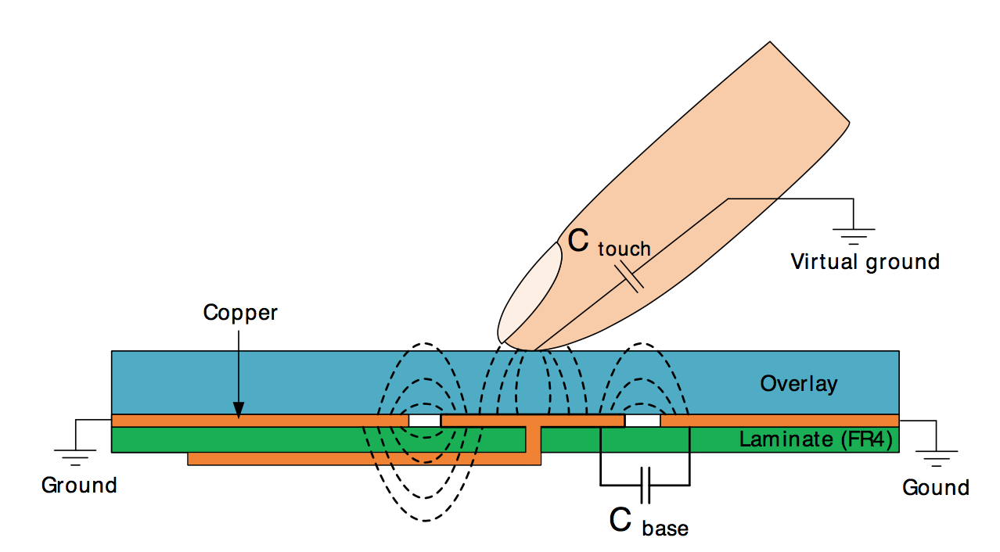
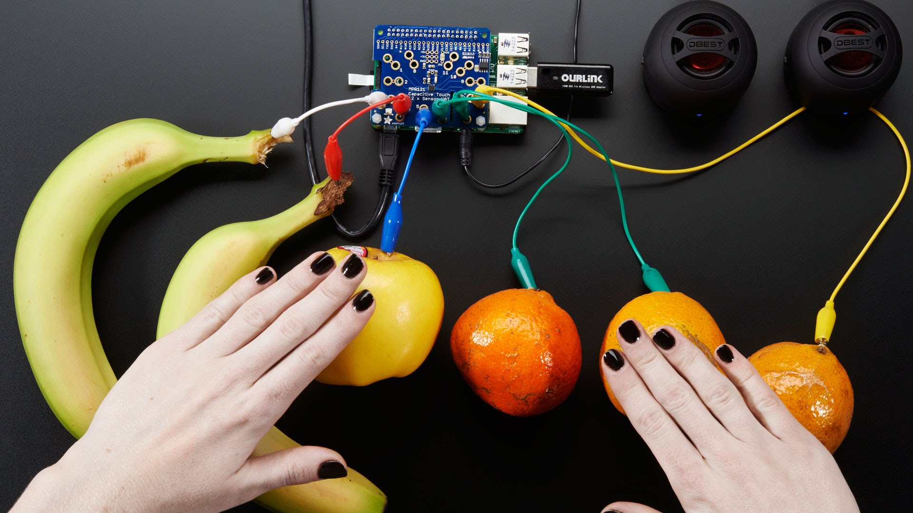
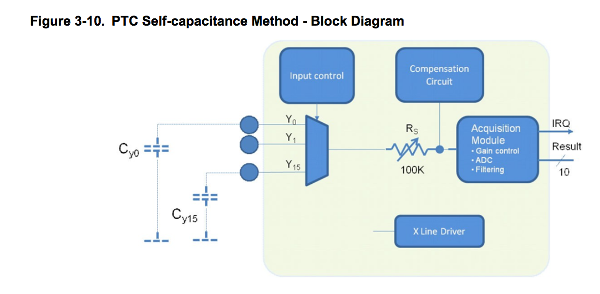
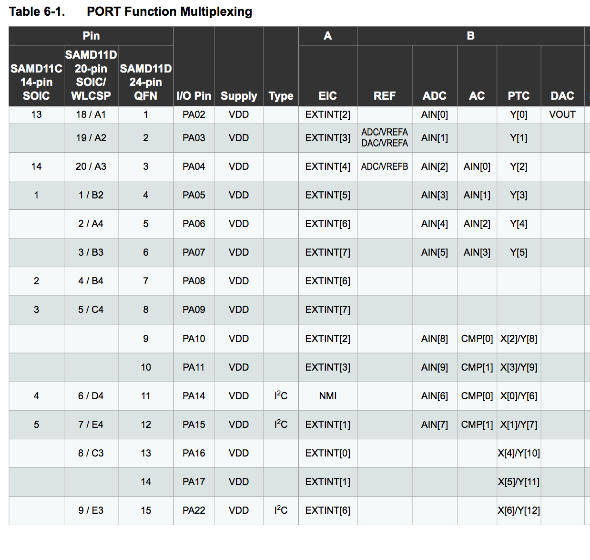
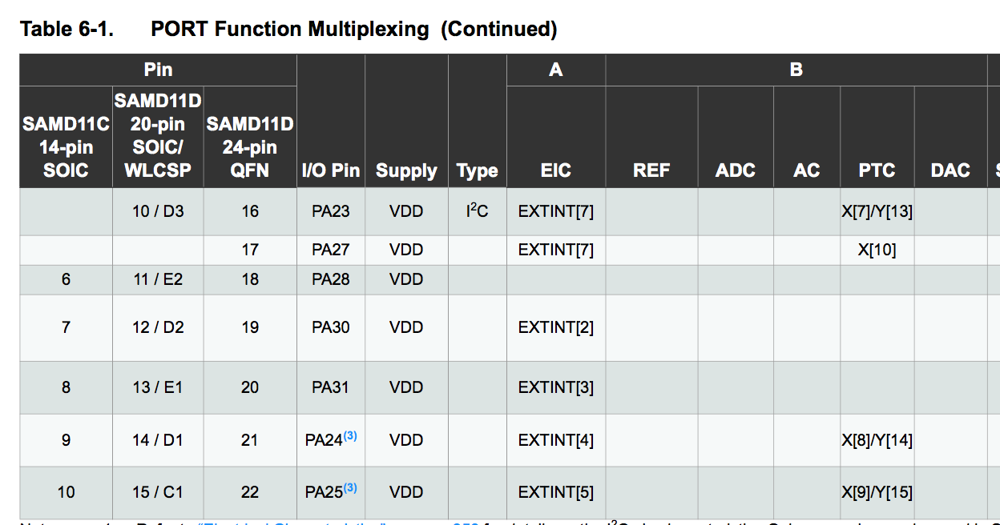

# LibrePTC

**Current status**: For hacker/experimental use only. Not clean enough for regular use!

It works on the SAMD11 architecture, but still cleaning things up to make it a "proper" API.

# Introduction
Ever wanted to add intuitive capacitive touch user interfaces to your hobby-grade Arduino project but frustrated by the lack of available libraries?  

LibrePTC is an Arduino-IDE compatible code library that provides first-ever open-source access to Atmel's latest-generation "Peripheral Touch Controller" (PTC). The PTC is a hardware-based capacitive sensor that can detect proximity of your fingers to special "pads" or areas of your circuit board. This lets you implement things like buttons, wheels and sliders without any actual moveable hardware or external components. 

The basic idea, (taken from the AN0040 datasheet.)

Self-capacitive sensing is amazing - you actually don't need any external components at all -- not even a resistor! In fact, the folks at Adafruit have even used such a thing to turn fruit into a user interface. Here is a screen shot from [@ladyada's wonderful Youtube explanation of touch sensing.](https://www.youtube.com/watch?v=Wk76UPRAVxI)

Until now, the PTC has been closed source and is undocumented, meaning you have to use [Atmel's proprietary libraries](http://www.atmel.com/tools/QTOUCHLIBRARY.aspx), if you want to access the hardware on your Arduino-compatable processors. 

## Atmel PTC - great hardware you probably already have

The Atmel PTC has been put into all sorts of current- and next-generation chips including the Arduino Zero. If you are more than a casual hobbyist, you very likely have a PTC-compatable chip sitting on your desk. The PTC can be found in the Atmel SAMD21, a processor frequently used in the hobbyist world and the foundation of the Arduino Zero, the Adafruit Feather M0, and many other designs. It was also added to the venerable Atmega 328pb.

The PTC peripheral is special - Atmel claims they have been a leader in capacitive sensor hardware for quite some time and has put all of their best thinking and design into their silicon, giving you register-based, highly-tunable access to a capacitive sensor. You get all sorts of hardware-based goodies, including selectable burst modes, true X/Y matrix sensing, averaging, selectable gain, accumulations, and asynchronous (interrupt driven) conversion. Atmel ships the PTC with a slew of libraries and cool design tools for serious ("i'm paid to do this") hardware engineers. They also provide free design support.

## The PTC downfall: a big binary blob called QTouch

Unfortunately, you won't find access to the hardware PTC in the Arduino IDE which is the most commonly used gateway drug for the recreational hardware hacker. The [painful reason](https://code.google.com/archive/p/arduino/issues/199) is that long-ago, Massimo from the Arduino foundation (and a fellow MIT-alum) didn't want anything that was closed-source infecting the Arduino ecosystem. Atmel only releases a closed-source software library to control the PTC called QTouch. You statically link this binary blob into your project to access the hardware.

The other major drawback of QTouch is code size. For simple needs, the Atmel QTouch library is over-engineered. For instance, on the ATSAMD11 MCU, which only sports 16KB of flash memory for your entire program, QTouch the library consumes nearly 8KB. This severely constrains your ability to do anything useful with your capacitive sense input. In my own case, I didn't care that QTouch was closed source -- I was motivated by the need for a smaller memory footprint. In my simple application, I couldn't even link my program code without dropping the bootloader and the USB stack. By comparison, LibrePTC operates in well under 1KB of code.

Of course, the QTouch library has many advantages. Aside from giving you access to the silicon, it also post-processes the output in many clever (and necessary) ways. In fact, most of the QTouch value-add is probably in this post-processing step which is why I'm sure Atmel decided to close source it. QTouch appears to be exceptionally robust. You can configure all sorts of things like moisture rejection, self-calibration, adjacent key rejection, etc. The penalty is a bizarre API and the code size.

LibrePTC is not aiming to recreate QTouch. That would be mostly pointless. If you need all of those special QTouch features, you should use QTouch. But if you just want a simple way to read capacitance and you don't want the encumbrance of the QTouch library, you might want to consider LibrePTC. 

# LibrePTC - the good news and the bad news

LibrePTC was based on an excruciating process of reverse engineering the PTC control registers using a JTAG debugger. Atmel does not publish anything about the PTC hardware design other than a simple block diagram, and the control registers are actually missing from the CMSIS definition files for the SAMD21/11. CMSIS is normally where a hardware manufacturer gives names and locations to all of the special memory-mapped IO on their chips. Therefore, everything in LibrePTC had to be discovered with ARM-code step debugging, repeated observation, and empirical testing. This reverse engineering was also aided by familiarity with the ATSAMD architecture's other peripherals which share many of the same design patterns.

For the user, there are two practical upshots to the fact that LibrePTC was reverse engineered. The good news is that the library and documentation is now free and open to the world, and perhaps one day will even find its way into the ArduinoCore. You can drop LibrePTC into your projects like you would any other Arduino library. You'll get a nice little API with lots of settings you can play with, and beautiful stable capacitive reads from your fingers (or fruit!). You select a sensor to read and get back a nice tidy 16-bit integer just like you were reading a analog-to-digital converter. That is the good part.

The bad news is that I have zero-knowledge of what most of the API actually does. I'm sure Atmel has tens of thousands of man-hours invested in their hardware and the design of the post-processing  toolkit. There are all sorts of settings like WCO and "burst mode" that frankly are beyond my understanding or comprehension and only passably documented in Atmel's application notes. I've never designed a production-grade capacitive touch system and so I've never even USED the QTouch libraries for anything important. Perhaps if we are lucky, someone with extensive knowledge of QTouch will aid in filling in some of the gaps.

The other bit of bad news is that LibrePTC is entirely untested. There is almost no risk in using it to your hardware, but it may not fully work. There are all sorts of calibration settings that probably work on my hardware but don't work in other scenarios. Atmel has 3 or 4 tuning registers that have (from my perspective) arbitrary values. Part of the work ahead is to disambiguate which parts of these tuning registers actually do which things.

# Project goals

LibrePTC is aimed to give PTC access for the casual hobbyist. I'm aiming to create a stable library that you can drop into your weekend project. Everything is released under a permissive MIT license.

If you are looking for robust, production-ready tools, please do not consider LibrePTC. For the love of all that is holy, please use QTouch. You'll get tons of free support from Atmel and only they really know how they're hardware works. Got it? I don't want to see self-driving cars or medical devices running around the world using a handful of poorly understood, undocumented registers. 'nuff said.

# Current status

LibrePTC is a library in active development. It is not ready for anything other than a very "hackerish" use. 

Currently only the SAMD11 is supported. The SAMD11 is a $1.15 ARM arm chip similiar to the ATTiny. If you want one, head over to MattairTech.

Very soon, LibrePTC should be available on the SAMD21, which is the same chip used in the Arduino Zero.

# Helping out

I could use some serious help on this project. I am a weekend electronics hacker (not my full time job) and I have a young family. 

Please fork and contribute!

# Using LibrePTC in your projects

[To be completed]

# Key resources

[ATSAMD11 Data Sheet](http://ww1.microchip.com/downloads/en/DeviceDoc/Atmel-42363-SAM-D11_Datasheet.pdf) - You'll find a brief overview of the PTC here but its quite short on details. The data sheet is useful because it establishes the common patterns of peripheral busses, control registers and clocks that the PTC hardware uses.

[ATSAMD21 Data sheet](http://ww1.microchip.com/downloads/en/DeviceDoc/40001882A.pdf) - Ditto the above

[Atmel QTouch Library User Guide](http://www.atmel.com/images/doc8207.pdf) (8207L-AT42-05/12) - Older document describing QTouch for the AVRs but useful to understand the terminology

[QTouch atmel-42195-qtouch-library-peripheral-touch-controller_user-guide](http://ww1.microchip.com/downloads/en/DeviceDoc/atmel-42195-qtouch-library-peripheral-touch-controller_user-guide.pdf) - The full user guide to the latest QTouch controller

# Library details

What follows is a bit of a brain-dump on what I know about the PTC and capacitive sensing in general to serve as a guide for future users.

Capacitive touch sensing relies on the idea that your fingers affect electrical fields around them because they are partial conductors. "Capacitive" is fancy engineering term for the idea of being able to "hold" a charge, meaning that if you put a small amount of energy into something it will be held and can later be released. Any pad, wire or conductor has some level of capacitance, including the wires in your project. When you make a capacitive sensor pad as a bit of copper, you're effectively making a capacitor.

When your finger approaches and gets near a capacitive sensing pad, it effectively alters the capacitance of the sensor pad because the "capacitor" is now a combination of the existing pad plus whatever your finger has.

Just to be super clear, when we talk about "capacitor", we aren't talking about a ceramic or electrolyic component you've added into your project as an external component. We are talking about the virtual capacitor formed by any electrical conductor.

How do you measure capacitance? I have no analog electronics training, but my basic understanding is that you charge the capacitor to a known voltage and then connect it to a resistor to ground. The resistor drains the capacitor, and the rate of the discharge is proportional to the capacitance.

The basic idea of any capacitive sensor is that there is a baseline level of capacitance in your sensor pad when there is no finger or object. This reference level can change based on your circuit design, power supply, case design, mounting, pad layout, etc. 

When a finger approaches and then touches the pad, the capacitance increases. This difference in capacitance is called "delta". Delta is the signal you actually care about when you want to read out a sensor.

In the case of touch measurement, the "capacitor" is charged by repeatedly raising the voltage of the sensor line of one of the GPIO pins. Then the voltage source is taken away, and the GPIO line is connected to a resistor and a analog to digital converter which measures the voltage as it declines. This design arrangement is called "self-capacitive" in Atmel's terminology. 

If you look at the design of the PTC from page 18 of the 42195 design guide, you see this basic structure.

In this chart, presumably the "input control" is the switch that either charges the capacitive sensing pad or routes the charge to the discharge resistor. Atmel doesn't show it explicitly but I think you can adjust the discharge resistor R(s) value, affecting the measurement. Atmel also has a compensation circuit that is basically a black box but seems to involve additional capacitors. There are hardware registers that I believe are involved in this compensation circuit.

The most important thing to know as a user is the connection between the peripheral inputs and the physical ports on your chip. In Atmel's terminology there are X lines and Y lines. The Y lines are the ones that actually measure capacitance and are connected to the resistor. The X lines are further "drivers" that can be used in the case of matrix measurement which is a more advanced step.  

Not every pin on your MCU can be a "Y" line. That means not every pin can be connected to a capacitive sensor pad and measure touches. Through the magic of "port muxing", Atmel gives you a way to connect different pins to different peripherals and   its not a 100% crossbar.

On page 13 and 14 of the SAMD11 data sheet, (page 21,22 of the SAMD21), you get a chart giving you a link between the phyisical pin on your chip, the "name" of the pin (e.g. "PB04"), and the peripherals that can be attached to it.

Look in the PTC column on the far right and you can see if the GPIO pin can handle either being a X line or a Y line or maybe even both.

This chart is vital for setting up a project using either QTouch or LibrePTC libraries. To read a sensor, you must provide the library a "Y" channel to read. Be careful! Some pins may already  be in use for things like your clock or I2C. For instance, PA22 and PA23 on the D11 chips can be used as PTC lines Y12 and Y13. But those two pins are assigned by the ArduinoCore to SDA and SCL already and in fact are only one of the two possible pairs of pins that can be mapped to the I2C hardware.

Another gotcha: Some Y lines don't map to physical pins on all variants. For instance Y10-Y13 on the SAMD21 architecture is not broken out on the "G" version of the chip, which is the most commonly-used variant (driving nearly all of the Arduino-Compatible SAMD cores.) This quirk is why the D11 architecture actually has more capacitive sensing lines than its big brother D21-G.

Just remember the API to LibrePTC is expecting you to provide it the Y line you want to measure.

# Internal guts - the choreography of a sensor read

There are two different parts of the QTouch/PTC dance. The first is setting up the peripheral itself. The second is performing the read.

## Clock Prerequisites

For the PTC to work, several things have to be in place. If you don't take these steps, you won't even see any data values in the registers and everything will silently fail. Clock configuration is apparently the bane of many ARM programmers so forgive me if I leave this a bit unexplained.

1. You need a 4Mhrz base clock fed into the PTC peripheral. This is a fairly specific clock and not normally set up by SAMD programs. The more typical arrangement is to route an external 32K crystal to the DPLL at 48Mhrz and to use that as the core clock. To get 4Mhrz the best way is to use the internal 8MHz OSCM8 clock with a 2:1 prescaler. The library accomplishes this by routing OSCM8 to GCG 3 that doesn't currently conflict with the ArduinoCore
2. You must enable routing of the clock through the Power Manager via PM->APBCMASK.reg |= PM_APBCMASK_PTC;

## Enabling the PTC - our first register access

Now that we have the PTC peripheral powered up and clocked, how do we access it? Lets do a quick primer on memory mapped IO. Most of the time a memory location is a part of your program memory. For instance, you declare a variable like this;

	long foo = 0x12345678;

And behind the scenes, your C/C++ compiler assigns a location to hold "foo" in the processor's onboard static (working) memory:

	0x20435500 = 78
	0x20435501 = 56
	0x20435502 = 34
	etc.

You can save and recall these locations in any that you want. 

Memory mapped IO is actually a memory location that doesn't route to your static ram. Instead, the "write" operation actually toggles a set of data lines inside a custom bit of silicon which then triggering gates and latches to do their magic interacting with analog and digital components. Its not even guaranteed that if you READ back the value you wrote you'll even get the same value back.

Registers exist in a special area of addressable RAM. FOr instance, the PTC is enabled and disabled by a control register I've named PTC_CTRLA (resident at 0x42002c00). Bit position 2 apparently enables and disables the PTC.

Obviously PTC_CTRLA is not an assigned variable in your program. So how do you convince your C compiler to read and write this register? One of the brilliant/infuriating things about C/C++ is that C will allow anything to become a pointer with a cast. Say I want to write 0xDEADBEEF to location $1234. Just cast $1234 to a pointer to a integer.

	(unsigned char *)0x1234 = 0xDEADBEEF;

So enabling the PTC register is perfomed by this code snippet: 

	*(int8_t *)PTC_CTRLA = *(int8_t *)PTC_CTRLA | 0x02;

This magic incantation will literally tickle the undocumented bit of hardware in your chip and turn on the PTC!

There is one trick you have to know. When you read and write to a memory-mapped IO register in the ARM world, you must synchronize your reads with a SYNCBUSY flag on a per-peripheral basis. Although not documented, the PTC is no exception to this rule and has its own SYNCBUSY flag that I've called PTC_SYNCBUSY. This register lives at 0x42002c01 in the SAMD11 world.

Why synchronize? Section 13.2 in the SAMD11 manual describes the rationale for this flag and the issue with clock domains:

	As the CPU and the peripherals can be clocked from different clock sources, possibly with widely different clock speeds, some peripheral accesses by the CPU needs to be synchronized between the different clock domains. In these cases the peripheral includes a SYNCBUSY status flag that can be used to check if a sync operation is in progress. As the nature of the synchronization might vary between different peripherals, detailed description for each peripheral can be found in the sub-chapter “synchronization” for each peripheral where this is necessary.
	
	In the datasheet references to synchronous clocks are referring to the CPU and bus clocks, while asynchronous clocks are clock generated by generic clocks.

So the basic procedure to write to a memory-mapped register is that you must check to make sure that SYNCBUSY is clear. Everywhere throughout low-level code you'll see this paradigm:

	while ( ADC->STATUS.bit.SYNCBUSY == 1 );
	[write something]
	while ( ADC->STATUS.bit.SYNCBUSY == 1 );
	[write something else]

The undocumented PTC peripheral also has a SYNCBUSY flag that lives at 0x42002c01 on the SAMD11. The following code waits for it to clear:

	while ( (*(uint8_t *)(PTC_SYNCBUSY) & (~0x7f)) != 0 );

Another gotcha is that some settings in the PTC peripheral cannot be updated while the peripheral is enabled. This pattern is common among the various others peripherals inside the chip and I was expecting to see it in the PTC. For example, read this section from the ADC peripheral section 31.8: 

	Some registers are enable-protected, meaning they can be written only when the ADC is disabled. Enable-protection is denoted by the Enable-Protected property in each individual register description.

I don't have a definitive map of which registers need to be written while the peripheral is disabled, but I am aware of at least a few and they are documented below.

# Setting up the PTC

To be completed

# Compensation

On page 14, Section 3.8.1. we can a description of the calibration values.

 Compensation circuit value used in pF = (p_cc_calibration_vals[channel_no]& 0x0F)*0.00675 +
((p_cc_calibration_vals[channel_no] >> 4) & 0x0F)*0.0675 +
((p_cc_calibration_vals[channel_no] >> 8) & 0x0F)*0.675 + ((p_cc_calibration_vals[channel_no]
>> 12) & 0x3 ) * 6.75

